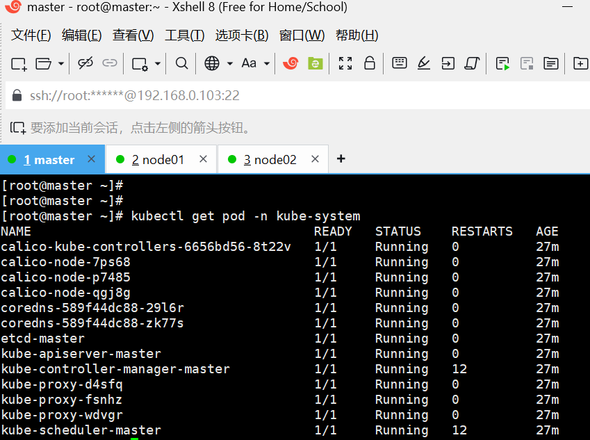

# TestOps Platform Deploy

自动化测试运维平台部署项目，提供从基础设施（K8s 集群）到上层测试工具链（禅道、Wiki.js、MeterSphere、AI 测试工具集）的一站式部署、卸载、备份和升级解决方案。

---

## 集群环境信息

| 主机名 | IP | 角色 | CPU | 内存 | 磁盘 | 操作系统 | 内核版本 |
|--------|-----|------|-----|------|------|---------|---------|
| master | 192.168.0.103 | control-plane | 6 Cores | 3.5 Gi | 37G | CentOS Stream 9 | 5.14.0-725.el9.x86_64 |
| node01 | 192.168.0.102 | worker | 4 Cores | 7.2 Gi | 70G | CentOS Stream 9 | 5.14.0-725.el9.x86_64 |
| node02 | 192.168.0.106 | worker | 6 Cores | 5.2 Gi | 37G | CentOS Stream 9 | 5.14.0-725.el9.x86_64 |

| 组件 | 版本 |
|------|------|
| Kubernetes | v1.36.3 |
| Containerd | v1.7.29 |
| Calico | v3.27.0 |
| Pod CIDR | 10.244.0.0/16 |
| Service CIDR | 10.96.0.0/12 |

---

## 架构概览

```
testops_platform_deploy/
├── .gitignore
├── README.md                                   # 项目总文档：架构说明、组件清单、部署顺序、全局CLI命令、故障处理规范
├── requirements.txt                            # 全局Python公共依赖（click, paramiko, PyYAML, jinja2...）
├── main.py                                     # 顶层统一CLI入口（click实现）
│
├── global_config/                              # 全局共享配置（所有组件公用）
│   ├── base_system.yaml                        # 基础操作系统通用配置（OS版本、内核参数、NTP、DNS）
│   ├── ssh_global.yaml                         # SSH连接公共参数：超时、并发、重试、密钥规则
│   ├── mirror_repo.yaml                        # 全局yum源、容器镜像仓库、软件下载源
│   └── network_policy.yaml                     # 通用网段、防火墙基础策略、端口清单
│
├── common/                                     # 顶层全局公共工具包（PEP8规范）
│   ├── __init__.py                             # 包说明
│   ├── exceptions.py                           # 全局自定义异常类（Config/SSH/Workflow/PreCheck/Dependency）
│   ├── logger.py                               # 统一日志管理器（控制台彩色 + 文件滚动）
│   ├── ssh_client.py                           # SSH远程执行、文件上传下载封装（paramiko）
│   ├── yaml_helper.py                          # YAML配置读写、深合并、变量插值工具
│   ├── task_base.py                            # 所有任务父类：统一钩子、异常捕获、日志标准、自动回滚
│   ├── workflow_state.py                       # 工作流状态持久化管理（断点续跑、进度追踪）
│   └── report_generator.py                     # 标准化报告生成工具（Text/JSON/YAML）
│
├── pkg_deploy/                                    # 【核心：所有业务部署组件目录，一组件一目录】
│   │
│   ├── k8s_cluster/                     # 组件：K8s集群部署模块（蛇形命名，统一规范）
│   │   ├── .gitignore
│   │   ├── README.md                           # 当前组件独立文档、支持版本、组件CLI命令清单
│   │   ├── module_main.py                      # 组件独立CLI入口（click）
│   │   ├── requirements.txt                    # 当前组件私有依赖
│   │   ├── config/                             # 组件专属静态配置（零硬编码）
│   │   │   ├── cluster_info.yaml               # K8s集群基础信息：pod网段、service网段、域名、CNI
│   │   │   ├── node_list.yaml                  # 节点清单：角色、ip、ssh端口、账号、标签
│   │   │   ├── software_version.yaml           # 允许选择的K8s目标版本清单（v1.29/v1.30/v1.31）
│   │   │   ├── system_init.yaml                # 系统初始化参数配置（swap/selinux/内核/防火墙）
│   │   │   ├── backup_policy.yaml              # 数据备份策略（etcd快照、证书、调度、保留）
│   │   │   └── uninstall_rules.yaml            # 卸载执行规则清单（drain→reset→清理残留）
│   │   ├── src/
│   │   │   ├── __init__.py
│   │   │   ├── constants.py                    # 模块内常量、阶段枚举、硬件要求、路径常量
│   │   │   ├── workflow/
│   │   │   │   ├── __init__.py
│   │   │   │   ├── pipeline.py                 # 工作流流水线调度器（顺序执行、断点续跑）
│   │   │   │   └── workflow_exception.py       # 模块内部自定义阶段异常（8种阶段异常）
│   │   │   ├── stages/                         # 分阶段业务逻辑（8阶段）
│   │   │   │   ├── __init__.py
│   │   │   │   ├── stage0_pre_check.py         # 阶段0：环境预检扫描（CPU/内存/磁盘/Swap/SELinux/防火墙）
│   │   │   │   ├── stage1_sys_init.py          # 阶段1：服务器系统标准化初始化
│   │   │   │   ├── stage2_containerd_setup.py  # 阶段2：容器运行时 containerd 安装配置
│   │   │   │   ├── stage3_kube_components.py   # 阶段3：kubeadm/kubectl/kubelet 安装
│   │   │   │   ├── stage4_master_init.py       # 阶段4：Master 节点 kubeadm init 集群初始化
│   │   │   │   ├── stage5_node_join.py         # 阶段5：Node 节点 kubeadm join 加入集群
│   │   │   │   ├── stage6_cni_deploy.py        # 阶段6：Calico 网络插件部署（VXLAN/IPIP）
│   │   │   │   └── stage7_cluster_verify.py    # 阶段7：集群部署后健康校验（DNS/Pod/Node）
│   │   │   ├── check.py                        # 环境预检 入口逻辑
│   │   │   ├── install.py                      # 完整安装 入口逻辑（先预检再安装）
│   │   │   ├── uninstall.py                    # 完整卸载 入口逻辑（逆序，幂等，清理所有资源）
│   │   │   ├── upgrade.py                      # 【预留】版本升级入口
│   │   │   ├── rollback.py                     # 【预留】升级回滚入口
│   │   │   └── backup.py                       # 数据备份入口（etcd快照+证书+配置）
│   │   ├── scripts/shell/                      # 附属shell脚本存放目录，Python按需调用
│   │   ├── runtime/                            # 运行时自动生成目录，禁止提交git
│   │   │   ├── workflow.state                  # 工作流状态持久化文件
│   │   │   ├── temp_cache/                     # 临时缓存：join命令、临时配置文件
│   │   │   └── logs/                           # 各操作日志（check/install/uninstall...）
│   │   └── reports/                            # 各类执行报告输出目录
│   │       ├── verify_reports/                 # 健康校验报告
│   │       └── backup_files/                   # 备份文件存储
│   │
│   ├── harbor/                                 # Harbor 镜像仓库部署
│   ├── jenkins/                                # Jenkins CI/CD 部署
│   ├── nginx/                                  # Nginx 1.26 二进制 RPM 安装
│   ├── postgresql16/                           # PostgreSQL 16 二进制安装
│   ├── redis7/                                 # Redis 7 二进制安装
│   ├── gitlab/                                 # GitLab CE 部署（Omnibus + Docker + 源码）
│   ├── mysql8.0/                               # MySQL 8.0 部署
│   ├── zentao/                                 # 禅道应用部署
│   ├── java_app_cicd/                          # Java 应用 CI/CD 部署
│   ├── zentao_cli/                          # 禅道部署 CLI（Python 工程）
│   ├── wikijs/                          # 后续扩展：Wiki.js文档平台
│   ├── prometheus_stack/                # 后续扩展：Prometheus监控栈
│   ├── metersphere/                     # 后续扩展：MeterSphere测试平台
│   └── ai_test_suite/                   # 后续扩展：AI测试工具集
│
├── orchestration/                              # 全局编排层：多组件批量执行流水线定义
│   ├── full_stack_install.yaml                 # 整套平台顺序部署流水线（3阶段）
│   ├── full_stack_uninstall.yaml               # 整套平台逆序批量卸载流水线
│   ├── full_stack_backup.yaml                  # 全平台统一批量备份（优先级分级）
│   └── full_stack_upgrade.yaml                 # 【预留】全组件批量升级（滚动策略）
│
├── runtime/                                     # 项目顶层全局运行时目录
│   └── global_logs/                            # 全局汇总日志
│
└── reports/                                     # 顶层汇总所有组件执行报告
    └── global_summary/                          # 全局部署/卸载报告汇总
```

## 技术栈

| 层级 | 技术选型 |
|------|---------|
| CLI 框架 | **Click** (Python) |
| 远程操控 | **Paramiko** SSH 库 |
| 容器运行时 | **Containerd** 1.7.x |
| K8s 版本 | **v1.29 / v1.30 / v1.31**（YAML 配置可选） |
| CNI 网络 | **Calico** 3.27.x (VXLAN / IPIP) |
| 目标 OS | **CentOS Stream 9** / RHEL 8.x |
| 配置管理 | YAML（零硬编码，全部剥离至配置文件） |

## 组件清单

| 组件 | 目录 | 状态 | 优先级 | 说明 |
|------|------|------|--------|------|
| K8s 集群部署 | `pkg_deploy/k8s_cluster/` | ✅ 已实现 | P0 | Kubernetes 集群自动化部署（8 阶段） |
| Harbor 镜像仓库 | `pkg_deploy/harbor/` | ✅ 已实现 | P1 | Harbor 2.11（源码编译 + Docker Compose） |
| Jenkins CI/CD | `pkg_deploy/jenkins/` | ✅ 已实现 | P1 | Jenkins 2.479（裸机 systemd + Docker + K8s） |
| GitLab 代码仓库 | `pkg_deploy/gitlab/` | ✅ 已实现 | P1 | GitLab CE 19.3（Omnibus / Docker / 源码构建） |
| 禅道应用部署 | `pkg_deploy/zentao/` | ✅ 已实现 | P1 | 禅道（PHP 源码编译 + Docker + K8s） |
| Java 应用 CI/CD | `pkg_deploy/java_app_cicd/` | ✅ 已实现 | P1 | Java 应用 Jenkins Pipeline + K8s 部署 |
| Nginx | `pkg_deploy/nginx/` | ✅ 已实现 | P1 | Nginx 1.26.2（二进制 RPM） |
| PostgreSQL 16 | `pkg_deploy/postgresql16/` | ✅ 已实现 | P1 | PostgreSQL 16.8（二进制 tar.gz） |
| Redis 7 | `pkg_deploy/redis7/` | ✅ 已实现 | P1 | Redis 7.4.1（二进制 RPM / 快速编译） |
| MySQL 8.0 | `pkg_deploy/mysql8.0/` | ✅ 已实现 | P1 | MySQL 8.0.35（二进制 tar.xz） |
| 禅道 CLI | `pkg_deploy/zentao_cli/` | ✅ 已实现 | P2 | 禅道部署 CLI（Python） |
| Prometheus 监控栈 | `pkg_deploy/prometheus_stack/` | 🔲 规划中 | P1 | Prometheus + Grafana + Alertmanager |
| MeterSphere | `pkg_deploy/metersphere/` | 🔲 规划中 | P1 | MeterSphere 测试平台 |
| Wiki.js | `pkg_deploy/wikijs/` | 🔲 规划中 | P2 | Wiki.js 文档平台 |
| AI 测试工具集 | `pkg_deploy/ai_test_suite/` | 🔲 规划中 | P3 | AI 辅助测试工具 |

## 部署顺序

### 完整部署链路

```
┌───────────────────────────────────────────────────────────────────┐
│  基础设施层                        K8s 平台层                       │
│  ────────────                      ──────────                       │
│  Nginx → Harbor → Jenkins → GitLab │                                │
│    ↓                                │                                │
│  PostgreSQL 16 + Redis 7 + MySQL   │                                │
│    ↓                                ↓                                │
│  禅道应用 ←────────────────── K8s 集群部署 (P0)                      │
│                                      ↓                              │
│                              Prometheus 监控栈 (P1)                  │
│                                      ↓                              │
│                              MeterSphere (P1)                       │
│                                      ↓                              │
│                              AI 测试工具集 (P3)                     │
│                                      ↓                              │
│                              Wiki.js (P2)                           │
└───────────────────────────────────────────────────────────────────┘
```

### 依赖关系

```
基础设施（裸机/VM）:
  Nginx / PostgreSQL 16 / Redis 7 / MySQL 8.0
    └──→ GitLab CE / Harbor / Jenkins / 禅道应用 / Java CI/CD

K8s 平台层:
  K8s 集群部署 ──────┬──→ Prometheus 监控栈 ──→ MeterSphere
                      │
                      ├──→ 禅道（可 K8s 部署）
                      │
                      ├──→ Wiki.js
                      │
                      └──→ Java 应用 CI/CD
```

| 组件 | 前置依赖 | 部署阶段 |
|------|---------|---------|
| Nginx | 无 | 基础设施层 |
| PostgreSQL 16 | 无 | 基础设施层 |
| Redis 7 | 无 | 基础设施层 |
| MySQL 8.0 | 无 | 基础设施层 |
| Harbor 镜像仓库 | Nginx（可选） | 基础设施层 |
| Jenkins CI/CD | JDK、Maven | 基础设施层 |
| GitLab CE | PostgreSQL、Redis、Nginx | 基础设施层 |
| 禅道应用 | MySQL、PHP | 平台服务层 |
| Java 应用 CI/CD | Jenkins、K8s 集群 | CI/CD 层 |
| K8s 集群部署 | 无 | 基础设施层 |
| Prometheus 监控栈 | K8s 集群 | 可观测性层 |
| Wiki.js | K8s 集群 | 平台服务层 |
| MeterSphere | K8s 集群、Prometheus 监控栈 | 平台服务层 |
| AI 测试工具集 | K8s 集群、MeterSphere | 平台服务层 |

## 全局 CLI 命令

### install — 安装部署

```bash
# 完整平台安装（按依赖顺序）
python main.py install --all

# 安装指定组件
python main.py install --components k8s_cluster prometheus_stack

# 打印安装计划（不实际执行）
python main.py install --all --dry-run

# 强制重新安装（跳过已安装状态检查）
python main.py install --components k8s_cluster --force
```

### uninstall — 卸载

```bash
# 完整平台卸载（逆依赖顺序）
python main.py uninstall --all

# 卸载指定组件
python main.py uninstall --components metersphere

# 强制卸载（跳过确认）
python main.py uninstall --all --force

# 预览卸载计划
python main.py uninstall --all --dry-run
```

### check — 健康检查

```bash
# 全平台健康检查
python main.py check --all

# 指定组件健康检查
python main.py check --components k8s_cluster

# 输出报告到指定路径
python main.py check --all --output reports/global_summary/health_report.txt
```

### backup — 数据备份

```bash
# 全平台备份
python main.py backup --all

# 指定组件备份
python main.py backup --components k8s_cluster zentao_cli
```

### 其他命令

```bash
# 查看所有组件部署状态
python main.py status

# 查看平台及各组件版本信息
python main.py version
```

## K8s 集群部署命令

### 一键安装/卸载

```bash
cd pkg_deploy/k8s_cluster

# 一键安装（Stage 0→7，支持断点续跑）
python module_main.py install

# 一键卸载（Stage 7→1 逆序回滚）
python module_main.py uninstall --force
```

### 分阶段命令

| 阶段 | 安装 | 回滚 |
|------|------|------|
| Stage 0 环境预检 | `python module_main.py check` | 只读，无需回滚 |
| Stage 1 系统初始化 | `python module_main.py install --stage 1` | `python module_main.py uninstall-stage 1 --force` |
| Stage 2 Containerd | `python module_main.py install --stage 2` | `python module_main.py uninstall-stage 2 --force` |
| Stage 3 K8s 组件 | `python module_main.py install --stage 3` | `python module_main.py uninstall-stage 3 --force` |
| Stage 4 Master 初始化 | `python module_main.py install --stage 4` | `python module_main.py uninstall-stage 4 --force` |
| Stage 5 Node 加入 | `python module_main.py install --stage 5` | `python module_main.py uninstall-stage 5 --force` |
| Stage 6 CNI 部署 | `python module_main.py install --stage 6` | `python module_main.py uninstall-stage 6 --force` |
| Stage 7 集群验证 | `python module_main.py install --stage 7` | `python module_main.py uninstall-stage 7 --force` |

```bash
# 单独执行指定阶段
python module_main.py stage 4    # 仅执行 Stage 4

# 查看部署状态
python module_main.py status

# 预览安装计划
python module_main.py install --dry-run
```

### 镜像准备（Master 节点执行）

```bash
# 拉取 K8s 组件镜像（保存到 ~/k8s-images/）
sudo bash scripts/pull_k8s_images.sh

# 拉取 Calico 镜像
sudo bash scripts/pull_k8s_images.sh --calico v3.27.0

# 拷贝到工作站
scp root@<master-ip>:~/k8s-images/*.tar pkg_deploy/k8s_cluster/images/
```

### 单独组件命令

每个组件都有独立的 CLI 入口，可脱离全局 CLI 单独调试运行：

```bash
# 完整安装（自动先执行预检）
python module_main.py install

# 从指定阶段开始安装（断点续跑）
python module_main.py install --stage 3

# 仅环境预检
python module_main.py check

# 完整卸载（销毁集群，幂等操作）
python module_main.py uninstall --force

# 备份集群数据
python module_main.py backup

# 查看部署状态
python module_main.py status
```

## K8s 集群部署流程（8 阶段详解）

```
┌──────────┐    ┌──────────┐    ┌──────────┐    ┌──────────┐
│ Stage 0  │───→│ Stage 1  │───→│ Stage 2  │───→│ Stage 3  │
│ 环境预检 │    │ 系统初始化│    │containerd│    │K8s组件安装│
└──────────┘    └──────────┘    └──────────┘    └──────────┘
                                                     │
┌──────────┐    ┌──────────┐    ┌──────────┐         │
│ Stage 7  │←───│ Stage 6  │←───│ Stage 5  │←───┐    │
│ 健康校验 │    │ CNI部署  │    │ Node加入 │    │    │
└──────────┘    └──────────┘    └──────────┘    │    │
                                                 ▼    │
                                          ┌──────────┐ │
                                          │ Stage 4  │←┘
                                          │Master初始化│
                                          └──────────┘
```

| 阶段 | 名称 | 核心操作 | 失败处理 |
|------|------|---------|---------|
| Stage 0 | 环境预检扫描 | 检查 CPU/内存/磁盘/Swap/SELinux/防火墙/内核模块 | **install 前强制执行，不通过立即终止** |
| Stage 1 | 系统初始化 | 关闭 swap/selinux/firewalld、加载内核模块、配置 sysctl/limits、NTP | 回滚：恢复原始配置 |
| Stage 2 | 容器运行时 | 安装 containerd、配置 cgroup=systemd、镜像加速 | 回滚：卸载 containerd |
| Stage 3 | K8s 组件安装 | 安装 kubeadm/kubectl/kubelet、配置 kubelet | 回滚：yum remove 组件 |
| Stage 4 | Master 初始化 | kubeadm init、配置 kubectl、生成 join token、证书管理 | 回滚：kubeadm reset |
| Stage 5 | Node 加入 | kubeadm join 各 Worker 节点、打标签 | 部分失败不阻塞其他节点 |
| Stage 6 | CNI 部署 | 下载并部署 Calico、修改 Pod 网段、等待就绪 | 回滚：kubectl delete calico |
| Stage 7 | 集群校验 | 检查节点 Ready/Pod Running/DNS 解析/Pod 创建删除 | 输出校验报告 |

## 工作流状态管理

### 状态持久化

每个阶段执行时实时写入 `runtime/workflow.state`（YAML 格式），记录：

```yaml
component_name: k8s_cluster
workflow_type: install
created_at: 1721923200.0
updated_at: 1721926800.0
stages:
  - stage_name: stage0_pre_check
    status: success
    start_time: 1721923201.0
    end_time: 1721923210.0
  - stage_name: stage1_sys_init
    status: success
    ...
  - stage_name: stage2_containerd_setup
    status: failed
    error: "SSH 连接失败: 10.0.0.21:22 — Connection refused"
    ...
```

### 断点续跑

```bash
# 从失败的 Stage 2 重新开始
python -m pkg_deploy.k8s_cluster.module_main install --stage 2
```

### 进度查询

```bash
python -m pkg_deploy.k8s_cluster.module_main status
# 输出：
# 组件: k8s_cluster
# 工作流: install
# 进度: 62.5%
#   ✓ stage0_pre_check [success]
#   ✓ stage1_sys_init [success]
#   ✓ stage2_containerd_setup [success]
#   ✗ stage3_kube_components [failed]
#   ○ stage4_master_init [pending]
#   ...
```

## 配置管理规范

### 配置分层

```
global_config/          ← 所有组件共享的全局配置
    ├── base_system.yaml        → 操作系统级通用参数
    ├── ssh_global.yaml         → SSH 连接通用参数
    ├── mirror_repo.yaml        → 镜像/软件源
    └── network_policy.yaml     → 网段/防火墙通用策略

pkg_deploy/<component>/config/     ← 各组件专属配置
    ├── cluster_info.yaml       → 集群拓扑信息
    ├── node_list.yaml          → 节点连接信息（支持节点级覆盖全局 SSH 配置）
    ├── software_version.yaml   → 可选的版本清单
    ├── system_init.yaml        → 系统初始化参数
    ├── backup_policy.yaml      → 备份策略
    └── uninstall_rules.yaml    → 卸载规则
```

### 配置优先级

```
节点级配置 > 组件级配置 > 全局配置 > 代码默认值
   (高)                                    (低)
```

### 零硬编码原则

- 所有 IP 地址、网段 → 从 `node_list.yaml` / `network_policy.yaml` 读取
- 所有软件版本号 → 从 `software_version.yaml` 读取
- 所有超时、重试参数 → 从 `ssh_global.yaml` 读取
- 所有文件路径 → 从 `constants.py` 的 `Paths` 类常量引用
- 所有端口号 → 从 `network_policy.yaml` 读取

## 故障处理规范

### 基本原则

| 原则 | 说明 |
|------|------|
| **失败停止** | 任何阶段执行失败，流水线立即停止，后续阶段不再执行 |
| **状态持久化** | 工作流状态实时写入 `runtime/workflow.state`，支持断点续跑 |
| **日志完整** | 每个操作步骤记录详细日志，存储于 `runtime/logs/` 目录 |
| **可回滚** | 每个阶段支持失败时回滚（`_rollback()`），卸载时幂等执行 |
| **错误输出** | 失败时输出完整节点信息 + 执行的命令 + 异常堆栈（stdout/stderr） |

### 异常体系

```
TestOpsException (基类)
├── ConfigError / ConfigNotFoundError / ConfigParseError / ConfigValidationError
├── SSHException → SSHConnectionError / SSHAuthenticationError / SSHCommandError / SSHTimeoutError
├── WorkflowException → StageFailedError / StageSkippedError / RollbackError
├── PreCheckError
└── DependencyError

K8s 模块专用异常 (src/workflow/workflow_exception.py):
├── K8sStageError
├── PreCheckFailedError
├── SystemInitError
├── ContainerdSetupError
├── KubeComponentInstallError
├── MasterInitError
├── NodeJoinError
├── CNIDeployError
├── ClusterVerifyError
└── TokenExpiredError
```

### 常见故障处理

| 故障现象 | 可能原因 | 处理方式 |
|---------|---------|---------|
| SSH 连接超时 | 网络不通 / 防火墙 | 检查 `global_config/ssh_global.yaml` 超时配置，验证网络可达性 |
| 预检不通过 | 硬件不满足 / 系统版本不兼容 | 查看 `runtime/logs/check.log`，确认最低要求 |
| K8s 组件安装失败 | YUM 源不可达 / 版本不存在 | 检查 `global_config/mirror_repo.yaml` 和 `software_version.yaml` |
| kubeadm init 失败 | 镜像拉取失败 / 端口冲突 | 查看 `runtime/logs/install.log`，检查 containerd 状态 |
| Node 加入失败 | Token 过期 / 证书问题 | 在 Master 上重新生成：`kubeadm token create --print-join-command` |
| Calico Pods 未就绪 | 镜像拉取超时 / 网段冲突 | 查看 `runtime/logs/install.log`，确认 Pod CIDR 配置 |
| 卸载残留 | iptables 规则未清理 / CNI 接口残留 | 手动执行 `iptables -F`、`ip link delete cni0` |

### 问题排查流程

```
1. 检查对应组件 runtime/logs/ 目录 → 定位失败阶段
2. 查看 runtime/workflow.state → 确认阶段执行状态和错误信息
3. 根据失败阶段查阅对应组件 README.md 的故障排查章节
4. 使用 python main.py check --components <component> 进行定点健康检查
5. 修复问题后使用 --stage <N> 从失败点恢复执行
```

## 开发规范

### Python 代码规范

- 严格遵循 **PEP8** 规范
- 所有公共方法/类添加 **docstring** 注释
- 使用 **类型注解**（Type Hints）
- 异常处理：捕获具体异常类型，记录完整堆栈后再抛出
- 日志使用 `common.logger.get_logger()` 统一获取

### 组件开发规范

- 每个组件目录结构**完全复用** `k8s_cluster` 模板
- 组件私有依赖写入 `<component>/requirements.txt`
- 组件独立 CLI 入口为 `<component>/module_main.py`
- 分阶段逻辑放在 `<component>/src/stages/` 目录
- 所有配置剥离到 `<component>/config/*.yaml`

## 快速开始

### 1. 安装依赖

```bash
pip install -r requirements.txt
```

### 2. 修改配置

```bash
# 编辑节点清单：填写实际服务器 IP、SSH 账号
vim pkg_deploy/k8s_cluster/config/node_list.yaml

# 编辑集群信息：确认 Pod/Service 网段
vim pkg_deploy/k8s_cluster/config/cluster_info.yaml

# 选择 K8s 版本
vim pkg_deploy/k8s_cluster/config/software_version.yaml
```

### 3. 环境预检

```bash
python -m pkg_deploy.k8s_cluster.module_main check
```

### 4. 执行部署

```bash
python -m pkg_deploy.k8s_cluster.module_main install
```

### 5. 验证集群

```bash
# 登录 Master 节点
ssh root@<master_ip>
kubectl get nodes
kubectl get pods -A
```

集群部署完成后，所有系统 Pod 应全部处于 Running 状态：


